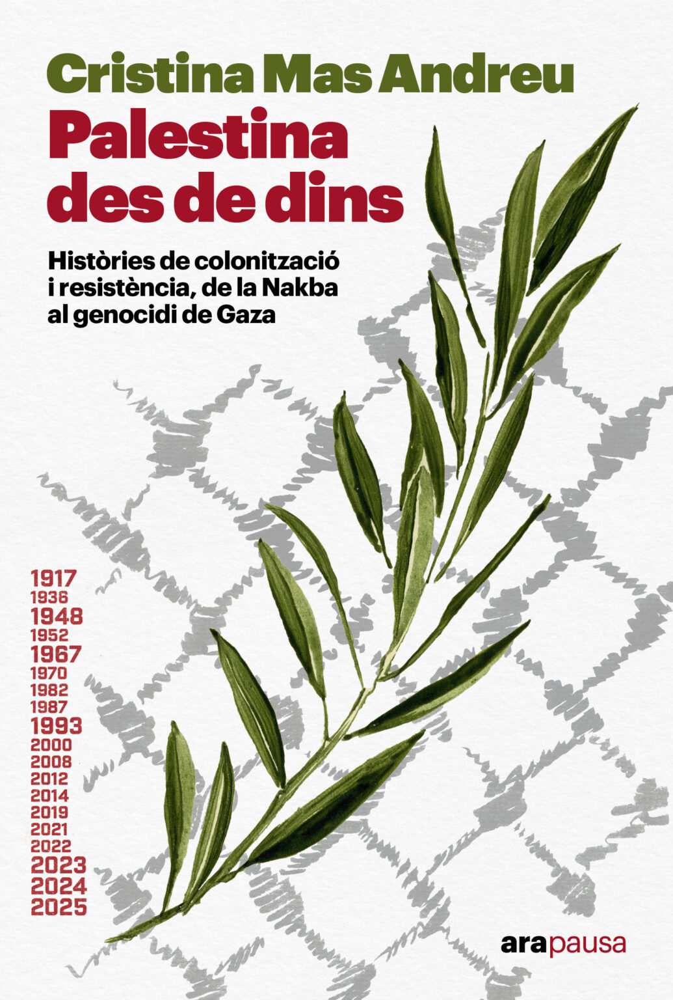
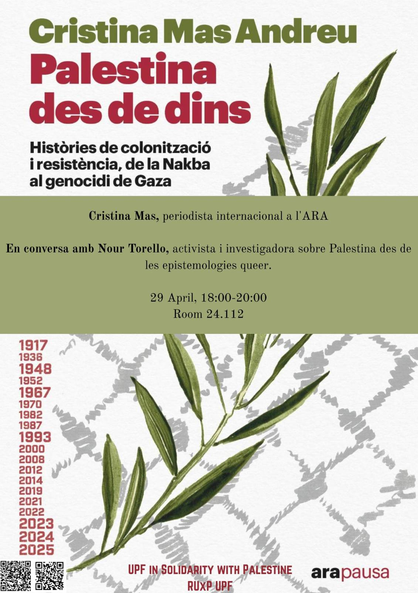

**Presentació del llibre de Cristina Mas en conversa amb Nour Torello**

**Dimarts, 10 de juny de 2025**

**L'Aula es publicarà aviat** 
**Ciutadella Campus** 
**Universitat Pompeu Fabra**

Cristina Mas és periodista i sotscap d’internacional al Diari Ara, on treballa des de l’any 2010. Llicenciada en Periodisme per la Universitat Pompeu Fabra i en Història Contemporània per la Universitat Autònoma de Barcelona, Cristina Mas està especialitzada l’àmbit Mediterrani. Va guanyar la Medalla d'or (2018) i de plata (2019) a la cobertura informativa multimèdia d'actualitat dels premis ÑH i actualment  és l’enviada especial al Marroc, Ceuta i Melilla, Algèria, Tunísia, Grècia, Turquia, el Líban, Palestina i el Mediterrani central.

Nour Torello és activista i investigadora sobre Palestina a partir d'epistemologies queer.
 
Hosted by the UPF in Solidarity with Palestine collective, the Red Universitaria por Palestina (RUxP), the Research Group on Gender and Inequalities (GRETA), and the Research Group on Health Inequalities, Environment - Employment Conditions Network (GREDS-EMCONET).

Compra el llibre: 

 

<!--Descarrega't el cartell: 
-->
